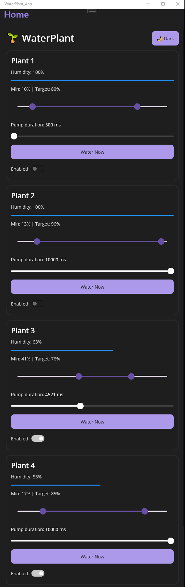
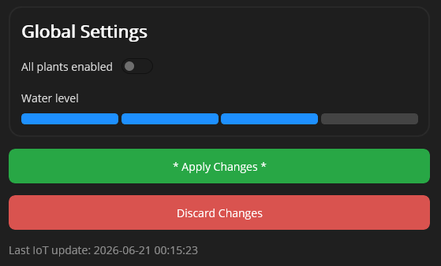

# WaterPlant – ESP32 IoT & .NET MAUI App
.NET MAUI application communicating with an ESP32 via AWS IoT Core (Device Shadow) to monitor soil moisture and control an automated irrigation system.

The application allows users to monitor soil humidity, configure watering settings, manually water plants, and synchronize all settings through AWS IoT Device Shadow.

---

# Features

- 🌱 Monitor humidity for 4 plants
- 💧 Automatic watering
- 🎯 Configurable minimum and target humidity
- ⏱ Configurable pump duration
- ✅ Enable/disable each plant individually
- 🚰 Manual watering
- 🌎 Master enable/disable switch
- 🪣 Water tank level indicator
- ☁ AWS IoT Device Shadow synchronization
- 🌙 Dark / Light theme

---

# Project Structure

```
ESP32_Iot&App_WaterPlant/
│
├── WaterPlant_App/
│   ├── App.xaml
│   ├── App.xaml.cs
│   ├── MainPage.xaml
│   ├── MainPage.xaml.cs
│   ├── MauiProgram.cs
│   └── Services/
│       └── AwsIotShadowService.cs
│
└── Iot_Software/
    ├── src/
    │   └── main.cpp
    └── include/
        └── Secrets.hpp
```

---

# Build

Build command for apk android build:

```bash
dotnet publish -f net10.0-android -c Release -p:AndroidPackageFormat=apk
```

---

# Required Configuration

Before building the project on your own, complete the following files.

## 1. AWSIotShadowService.cs

File:

```
ESP32_Iot&App_WaterPlant/WaterPlant_App/Services/AWSIotShadowService.cs
```

Configure:

- AWS Access Key
- AWS Secret Key
- AWS Region
- Thing Name

Example:

```csharp
private readonly string _thingName = "YOUR_THING_NAME";

new BasicAWSCredentials(
    "YOUR_ACCESS_KEY",
    "YOUR_SECRET_KEY"
);
```

---

## 2. Secrets.hpp

File:

```
ESP32_Iot&App_WaterPlant/Iot_Software/include/Secrets.hpp
```

Configure:

```cpp
ssid
password

aws_endpoint
aws_port

root_ca
device_cert
private_key

shadowUpdateTopic
shadowDeltaTopic
mqtt_topic
```

---

# AWS Setup

To use this project, create and configure an AWS IoT Thing.

Required steps:

- Create an AWS IoT Thing
- Generate certificates
- Attach an IoT Policy
- Download:
  - Device certificate
  - Private key
  - Amazon Root CA
- Configure the Thing Name in both:
  - `AWSIotShadowService.cs`
  - `Secrets.hpp`
- Configure the AWS IoT endpoint

The application communicates using AWS IoT Device Shadow.

---

# User Interface

## Plant Monitoring

The application allows monitoring and controlling four independent plants.

Features include:

- Current soil humidity
- Humidity progress bar
- Minimum and target humidity range slider
- Pump duration adjustment
- Manual watering
- Individual enable/disable
- Dark/Light mode

<p align="center">
  
</p>

---

### Global Settings

The Global Settings section provides:

- Master control for all plants
- Water tank level indicator
- Apply/Discard pending changes
- Last synchronization time

<p align="center">
  
</p>

# ESP32 Logic

Every 15 minutes the ESP32:

1. Connects to AWS IoT
2. Reads water tank level
3. Reads soil humidity
4. Determines if watering is required
5. Waters until the target humidity is reached
6. Publishes the updated state to AWS IoT Shadow

Manual watering commands can also be received from AWS.

---

# Safety Features

- Pump duration limits
- Humidity limits
- Target humidity validation
- Plant enable/disable
- Maximum watering retries
- Low water protection

---

# Technologies

- ESP32
- Arduino
- C++
- .NET MAUI
- C#
- AWS IoT Core
- AWS Device Shadow
- MQTT
- WiFi

---

# License

This project was developed as a personal IoT learning project demonstrating embedded systems, cloud synchronization, and cross-platform application development.